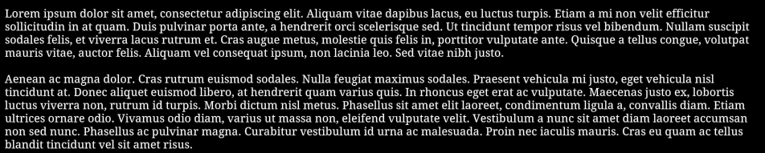

!! Under active development, api *may* change, readme may not necessarily be up to date !!

!! Todo: Move documentation into github wiki pages

Sample text rendered from the engine with OpenGL as the backend


# Antho Foxo's Font Engine Overview
This is an operating system and rendering api agnostic text rendering engine. We are using signed distance fields (sdfs) bitmaps inside a texture cache to achive scalable rendering at any font size without having to cache multiple sizes of each glyph. As text is drawn it'll populate the texture cache as needed.

### Contributor list
AnthoFoxo

## Dependencies
Dependencies are kept at a minimum, only requiring the following:
* [stb_truetype.h](https://github.com/nothings/stb/blob/master/stb_truetype.h)
* [stb_rect_pack.h](https://github.com/nothings/stb/blob/master/stb_rect_pack.h)
* c std lib: malloc, realloc, free, memset, memcpy, strlen

These dependencies are expected to be setup before including this library.


`implementation.c`
```c
#define STB_RECT_PACK_IMPLEMENTATION
#define STB_TRUETYPE_IMPLEMENTATION
#define AFFE_IMPLEMENTATION
#include "stb_rect_pack.h"
#include "stb_truetype.h"
#include "af_fontengine.h"
```

`main.c`
```c
// Assume this is always included in the examples
#include "af_fontengine.h"

int main()
{
    // use public api functions
}
```

## API Convention
* Macros are prefixed with `AFFE_` with exception of `NULL`, `FALSE`, and `TRUE`
* Functions are prefixed with `affe_`
* Implmentation specific functions are prefixed with `affe__`
* Functions always take `affe_context*` as their first parameter, with exception of `affe_context_create`
* User procs always have the user pointer passed as the first parameter

# Creating and deleting the context
All state is contained inside a context. To create a context, you must fill out `affe_context_create_info` which tells the the engine various important details to be usable. When you are done, make sure to delete it.

```c
int main()
{
    affe_context_create_info info;
    memset(&info, 0, sizeof(affe_context_create_info));

    // Width and height of the texture cache
    info.width = 512;
    info.height = 512;

    // The proc functions will be called throughout the lifetime of the engine
    // Your rendering implmentation is defined by these functions
    // The user pointer allows you to use custom data for your implmentation
    info.user_ptr = NULL;
    info.create_proc = NULL;
    info.update_proc = NULL;
    info.draw_proc = NULL;
    info.delete_proc = NULL;
    
    // Rasterization settings (more about these later)
    info.edge_value = 204;
    info.padding = 8;
    info.size = 48;

    // Create the context with all the settings
    affe_context* ctx = affe_context_create(&info);

    // Context failed to create
    if(!ctx) return 1;

    // Use the api!

    // After you're done, delete the context
    affe_context_delete(ctx);
}
```

# Loading fonts
The engine provides no way to do file io, you must load font files (ttf/otf) into a memory buffer and provide that to use fonts.

```c
// ^^^ Context is created ^^^

// Font data must stay allocated during operation of the engine
// The data pointer must not change during operation

// Notice, current security issue in stb_truetype
// Only use trusted fonts, no range checking is done
void* data = loadfile("font.ttf");

// Font files can contain more than one font
// Use 0 if unsure                  v
int font = affe_font_add(ctx, data, 0, TRUE);
//                                     ^^^^
// The engine can take ownership of the data pointer for you
// Set to true to give the engine ownership of the data, false otherwise

// If font is `AFFE_INVALID` then the font failed to be added
// After a font is loaded you can set it as the current font
if(font != AFFE_INVALID) affe_set_font(ctx, font);

// vvv Context is deleted vvv
```

# Drawing text
Drawing text is pretty simple, the easiest method is to call `affe_text_draw`.
All text is expected to be UTF8 encoded.

```c
// ^^^ Context is created and a font loaded and set ^^^
const char* text = "Hi mom!";

// This specifies where the draw origin is, in viewport space
//                  vvv  vvv  
affe_text_draw(ctx, 100, 100, text, NULL);
//                                  ^^^^
// This specifies where the text should stop rendering,
// If null `strlen` will be used to calculate this for you.

// vvv Context is deleted vvv
```

This is enough for the engine to submit the proper calls to draw this text.
However we did not hook up and of the proc functions so nothing is visible.
OpenGL will be used to demonstrate implmentation.

# Rendering implementation / OpenGL
The engine alone makes no calls to any graphics api for you. You must provide this yourself. To do this you set the `xxx_proc` functions in the `affe_context_create_info` struct.

This example is written with modern opengl 3

```c

struct user_data
{
    unsigned int texture;
    unsigned int vao, vbo;
    unsigned int program;
}

typedef struct user_data user_data;

static int create_proc(void* user_ptr, int w, int h)
{
    // Create an opengl texture with the specified size
    // Pixel data will later be provided in parts to update the image
    // Setup the format to use one channel unsigned bytes
    // internalFormat = R8, format = GL_RED, type = GL_UNSIGNED_BYTE

    // Create a vertex array and an array buffer,
    // buffer size is specified during context creation
    // buffer size in bytes = buffer_quad_count * 6 * sizeof(affe_vertex)
    // The buffer should be setup to use GL_STREAM_DRAW
    
    // The buffer will have three attributes stride = sizeof(affe_vertex)
    // 2 floats for xy position;             offset = (const void*)offsetof(affe_vertex, x)
    // 2 floats for st texture coordinates   offset = (const void*)offsetof(affe_vertex, s)
	// 4 floats for rgba color               offset = (const void*)offsetof(affe_vertex, r)

    // Create a vertex and fragment shader, compile and link them into a program

    // An example shader will be provided later
	
    // Return `TRUE` if everything was successful, `FALSE` otherwise
	return TRUE;
}

static void delete_proc(void* user_ptr)
{
    // Delete the texture, vertex array, vertex buffer, and shader program
}

static void update_proc(void* user_ptr, int x, int y, int w, int h, void* pixels)
{
    // An offset and size is provided to you along with pixel data to modify the texture

    // Bind your texture and call subimage

    // !! NOTICE !!
    // A common pitfall with updating the texture is row alignment
    // The engine does not align your pixel data
    
    // Set the row alignment to 1 to successfully upload the data
    // glPixelStorei(GL_UNPACK_ALIGNMENT, 1);

    // Restore it back to default after upload if needed
    // glPixelStorei(GL_UNPACK_ALIGNMENT, 4);
}

static void draw_proc(void* user_ptr, affe_vertex* verts, long long verts_count)
{
    // The vertex is provided along with the number of verticies
    // This is in an interleaved format

    // Vertex positions are provided in viewport space,
    // you may want to iterate over the vertices here
    // to put them into normalized device space. (It's okay to modify them)
    // Alternativly you can use an orthographic projection matrix in the shader

    // Bind the array buffer and use subdata to update the data store; see invalidation below
    // Make sure your texture, vertex array, and program are bound as well

    // You'll want alpha blending enabled as well for good looking text

    // Finally submit the draw call

    // -- Invalidation --
    // Since the array buffer is reused over and over
    // you can take advantage of buffer invalidation to potentially increase render times
    // without opengl 4+ or extensions you must use `glBufferData` to do this
    // Call `glBufferData` using the same, exact same size, and usage hint, with NULL as the data
    // After invalidation you can use subdata to put data into the buffer
}

static affe_context* make_context(user_data* impl_data)
{
    affe_context_create_info info;
    memset(&info, 0, sizeof(affe_context_create_info));
    info.width = 512;
    info.height = 512;

    // Set the user pointer so we can access our data
    info.user_ptr = impl_data;

    // This function is called once when creating the context
    // A perfect time to create the texture, buffers, and shader program
    info.create_proc = &create_proc;

    // Called when the context is being deleted
    info.delete_proc = &delete_proc;

    // Called when a new glyph is being inserted into the texture cache
    info.update_proc = &update_proc;

    // Called when text is ready to be displayed
    info.draw_proc = &draw_proc;
    
    // How many quads to allocate for our buffer?
    info.buffer_quad_count = 256;

    // Rasterization settings
    info.edge_value = 204;
    info.padding = 8;
    info.size = 48;
}

int main()
{
    // Using whatever api you like, create a window and an opengl context
    // Then make it current on whatver you'll be using for your rendering thread
    // I'd personally suggest glfw3 and glad2

    user_data data;

    affe_context* ctx = make_context(&data);

    // Load a font into memory and set it for use in the library

    // Start main game loop

    const char* text = "Oh hey there, what's going on?";
    affe_text_draw(ctx, 100, 100, text, NULL);

    // End main game loop

    affe_context_delete(ctx);
}
```

# How to write the shaders, text is blurry
Due to the nature of how sdfs work, you cannot just simply output the texture sample.
The sample given represents how far from the glyph edge you are.

Additionally, doing some super/multisampling will greatly improve the looks of the text.

`text.vert.glsl`
```glsl
#version 330 core

layout(location = 0) in vec2 vert_pos;
layout(location = 1) in vec2 vert_tex;
layout(location = 2) in vec4 vert_col;

out vec2 frag_tex;
out vec4 frag_col;


// Simple vertex shader, set the output and forward the information
void main(void)
{
    // You will need to apply a transformation to vert_pos if it wasn't done in c
    gl_Position = vec4(vert_pos, 0.0, 1.0);
    frag_tex = vert_tex;
    frag_col = vert_col;
}
```

`text.frag.glsl`
```glsl
#version 330 core

in vec2 frag_tex;
in vec4 frag_col;

layout(location = 0) out vec4 out_col;

uniform sampler2D u_sampler;

// This is the same value as in the c code,
// however this is in the 0-1 range where in c it's 0-255
const float onedge_value = 0.8; // 204

void main(void)
{
    // Set output color, edge of the glyph is controlled by alpha
    out_col = frag_col;

    // Sample the texture to find out how far from the edge we are
    // when `dist > onedge_value`  you are inside the glyph
    // otherwise you are outside the glyph
    // Higher on edge values give better outlines
    float dist = texture(u_sampler, frag_tex).r;

    // Gets the sum of the absolute derivatives in x and y
    // using local differencing for the input argument
    float w = fwidth(dist);

    // Use this value to smooth out a tiny edge,
    // this will automatically scale nicely for any size text
    out_col.a *= smoothstep(onedge_value - w, onedge_value + w, dist);
}
```
# Fine tuning rasterization settings
The three main rasterizer settings are `edge_value`, `padding`, and `size`
* **size** - controls at what size the sdf will be created, unrelated to font size. The higher the better looking text you'll get, at the cost of texture cache space. 48 is a good default.
* **padding** - controls how much space is put around the glyph, this is needed to actually store the distance field. The heigher the better edges can look, at the cost of texture size, 8 is a good default.
* **edge_value** - controls at what value is considered the "edge" of the glyph, in shaders this is used to discard or blend away stuff too far away. The higher this is, the better represented the distance fields are. 204 (0.8) is a good default.

# State management
The engine has a concept of a state stack. Where you can change rendering settings and push/pop for later.

```c
// the current state now has red as the color
affe_set_color(ctx, 1, 0, 0, 1);

// You can push this into the stack to freely modify the state
// without worrying about losing old values
affe_state_push(ctx);

// Change some state, color is now yellow
affe_set_color(ctx, 1, 1, 0, 1);

// Pop the state off the stack, old state is restored
// Color is now red again
affe_state_pop(ctx);

// If you ever want default state values
affe_state_clear(ctx);
```

# Changing state
State includes color, current font, styling etc.

```c
affe_set_color(ctx, r, g, b, a); // rgba, engine does not clip these (0-1)
affe_set_font(ctx, font);
affe_set_size(ctx, size); // Font size in pixels
```

# Font fallbacks
After fonts are loaded you can set fonts up as a fallback for others.
For example, if you font thats currently set doesn't contain a glyph. It'll look through its' fallbacks to try finding one. No fallbacks are setup by default.

```c
int main_font = affe_font_add(...);
int fallback_font = affe_font_add(...);
// return `TRUE` on success, `FALSE` otherwise
int success = affe_font_fallback(ctx, main_font, fallback_font);

affe_set_font(ctx, main_font);

// If this succeeds, when the main font is used and a glyph cannot be found
// It'll look at the fallbacks to try finding a glyph to use
```

# Engine flags
The `affe_context_create_info` has a flags field which is reserved for later.

# Error handling
There are a few possible errors, some functions can return `NULL` or `AFFE_INVALID` as an error.
Other errors are handled using the `error_proc` inside `affe_context_create_info`.

When stack overflow or underflow errors occur, an error is reported but the engine remains in usable state.

When the cache fails to find a location for a glyph, the glyph will just not render. Theres no current way to fix this other than to recreate the context with a larger cache.

# Known bugs
* Text rendering ignores control characters, rendering as a small box. (include newlines etc)
* Some international glyphs do not rasterize correctly.

# Planned features
* Font kerning
* Cache resizing
* Cache clearing
* Text alignment